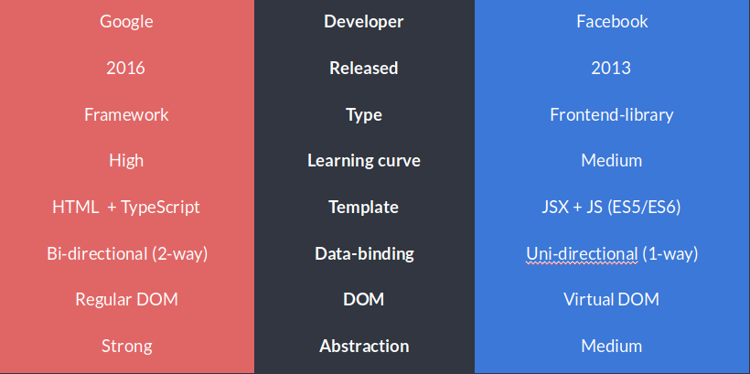

# Intro

# Что такое Ангуляр?

Angular представляет фреймворк от компании Google для создания клиентских приложений. Прежде всего он нацелен на разработку SPA-решений (Single Page Application), то есть одностраничных приложений. В этом плане Angular является наследником другого фреймворка AngularJS. В то же время Angular это не новая версия AngularJS, а принципиально новый фреймворк.

# Плюсы и минусы Angular

Angular — это супергероическая среда JavaScript MVVM, основанная в 2009 году, которая отлично подходит для создания интерактивных веб-приложений.

# Преимущества Angular:

- Angular используется вместе с Typescript. 
- Он имеет исключительную поддержку для этого.
- Angular-language-service — обеспечивает интеллектуальные возможности и автозаполнение шаблона HTML-компонента.
- Новые функции, такие как generation Angular, использующие библиотеки npm из CLI, generation, и разработка компонентов, использующая Angular.
- Подробная документация, позволяющая разработчику получить всю необходимую информацию, не прибегая к помощи его коллег. Однако это требует больше времени для обучения.
- Односторонняя привязка данных, которая обеспечивает исключительное поведение приложения, что сводит к минимуму риск возможных ошибок.
- MVVM (Model-View-ViewModel), которая позволяет разработчикам работать отдельно над одним и тем же разделом приложения, используя один и тот же набор данных.
- Внедрение зависимостей от компонентов, связанных с модулями и модульностью в целом.
- Структура и архитектура, специально созданные для большой масштабируемости проекта.

# Недостатки Angular:

- Разнообразие различных структур (Injectables, Components, Pipes, Modules и т. д.) усложняет изучение по сравнению с React и Vue.js, у которых есть только «Component».

Компании, использующие Angular: Microsoft, Autodesk, MacDonald’s, UPS, Cisco Solution Partner Program, AT&T, Apple, Adobe, GoPro, ProtonMail, Clarity Design System, Upwork, Freelancer, Udemy, YouTube, Paypal, Nike, Google, Telegram, Weather, iStockphoto, AWS, Crunchbase.

# Плюсы и минусы React

React — это библиотека JavaScript, разработанная Facebook в 2013 году, которая отлично подходит для создания современных одностраничных приложений любого размера и масштаба.

# Преимущества React:

- Легко изучить, благодаря простому дизайну, использованию JSX (HTML-подобный синтаксис) для шаблонов и очень подробной документации. Разработчики тратят больше времени на написание современного JavaScript и меньше беспокоятся о коде, специфичном для фреймворка.
- Очень быстрая, благодаря реализации React Virtual DOM и различным оптимизациям рендеринга.
- Отличная поддержка рендеринга на стороне сервера, что делает его мощной платформой для контент-ориентированных приложений.
- Первоклассная поддержка Progressive Web App (PWA) благодаря генератору приложений `create-react-app`.
- Привязка данных является односторонней, что означает меньше нежелательных побочных эффектов.
- Redux, самая популярная платформа для управления состоянием приложений в React, ее легко учить и использовать.
- React реализует концепции функционального программирования (FP), создавая простой в тестировании и многократно используемый код.
- Приложения могут быть созданы с помощью TypeScript или Facebook’s Flow, имеющими встроенную поддержку JSX.
- Переход между версиями, как правило, очень прост: Facebook предоставляет «кодовые модули» для автоматизации большей части процесса.
- Навыки, полученные в React, могут быть применены к разработке на React Native.

# Недостатки React:

- React не однозначен и оставляет разработчикам возможность выбирать лучший способ развития. Это может быть решено сильным лидерством проекта и хорошими процессами.
- Сообщество делится по способам написания CSS в React, которые разделяются на традиционные таблицы стилей (CSS Modules) и CSS-in-JS (т.е. Emotion и Styled Components).
-- React отходит от компонентов на основе классов, что может стать препятствием для разработчиков, которым более комфортно работать с объектно-ориентированным программированием (ООП).
- Смешивание шаблонов с логикой (JSX) может сбить с толку некоторых разработчиков при первых знакомствах с React.

Компании, использующие React: Facebook, Instagram, Netflix, New York Times, Yahoo, Khan Academy, Whatsapp, Codecademy, Dropbox, Airbnb, Asana, Atlassian, Intercom, Microsoft, Slack, Storybook и многие другие

# Как устроен фреймворк?

Фреймворк ценен не сам по себе, а за счет своих составляющих, упрощающих разработку. Что предлагает Angular:

- Компоненты. Структурные блоки, из которых и состоит приложение, написанное на Angular. Если вам нужно написать сайт – минимальными компонентами будут шапка, контент и футер. Физически Angular повторяет структуру Java – все структурные блоки хранятся в отдельных файлах, что упрощает разработку и поддержку сложного приложения. Важная особенность: компоненты полностью автономны, изначально зависимостей между компонентами нет. Это позволяет вам безболезненно добавлять или убирать любые из них.
- Модули. Если просто, то модули – это скрипты компонента. У каждого компонента есть как минимум один центральный модуль, описывающий основную линию поведения. Обычно к основному модулю присоединяют ряд дополнительных, расширяющих функционал оригинального – это позволяет построить систему с высокой инкапсуляцией (изолированностью частей друг от друга). Один дополнительный модуль = одно действие.
- Формы. Набор готовых форм, через которые пользователь отправляет данные на сервер. Форм – много, на любой вкус и для любой ситуации.
- Сервисы. Если модули – это скрипты, то сервисы – это классы. Они могут как хранить информацию (data-driven service), так и что-то делать. Сервисами удобно соединять между собой разные части приложений, потому что для сервиса нет проблемы в том, чтобы обратиться к какому-либо компоненту, модулю или форме. Сервисы могут иметь (и чаще всего имеют) свою собственную архитектуру, которая тоже строится по принципам «Один сервис = одно действие».
- Директивы И пайпы. Глобальные модули с поведением сервисов. Если с помощью сервисов вы управляете одной страницей, то с помощью директив можно управлять всеми страницами сразу. Правильно составленные директивы в десятки раз упрощают разработку нового функционала для уже готового приложения.
