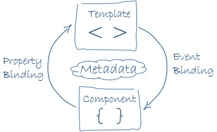
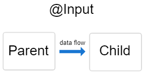
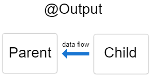
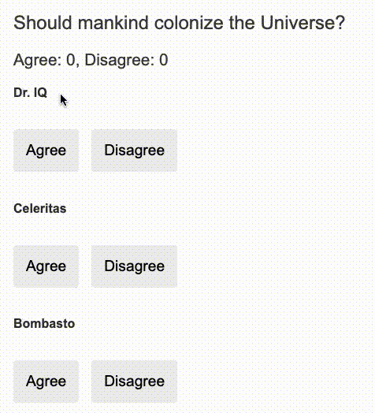
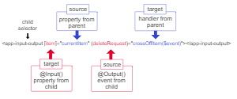
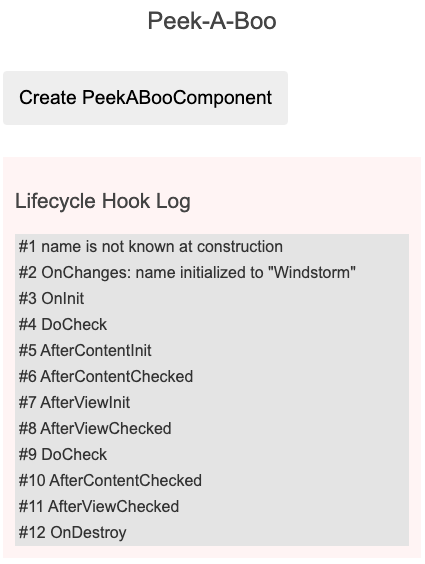
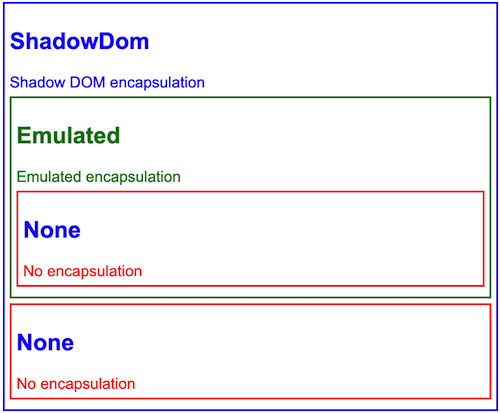

# Compoents

- Компоненты. Структурные блоки, из которых и состоит приложение, написанное на Angular. Если вам нужно написать сайт – минимальными компонентами будут шапка, контент и футер. Физически Angular повторяет структуру Java – все структурные блоки хранятся в отдельных файлах, что упрощает разработку и поддержку сложного приложения. Важная особенность: компоненты полностью автономны, изначально зависимостей между компонентами нет. Это позволяет вам безболезненно добавлять или убирать любые из них.

```typescript
@Component({
  selector: 'app-todo',
  templateUrl: './todo.component.html',
  // template: '<h1>Hello World!</h1>',
  styleUrls: ['./todo.component.scss'], 
  //  styles: ['h1 { font-weight: normal; }']
  changeDetection: ChangeDetectionStrategy.OnPush,
  providers: [ HeroService ], 
  interpolation: ['{{', '}}']
})
export class TodoComponent {
    
}
```


# Binding

## one-way data binding

[hero] property binding
(click) event binding
{{hero.name}} interpolation

## Binding to a property

```html

<tr><td [colSpan]="1 + 1">Three-Four</td></tr>
<button type="button" [disabled]="isUnchanged">Disabled Button</button>
```

```typescript
class Component {
    itemImageUrl = '../assets/phone.svg';
}
```

## Attribute binding
```html
<!-- create and set an aria attribute for assistive technology -->
<button type="button" [attr.aria-label]="actionName">{{actionName}} with Aria</button>
<tr><td [attr.colspan]="1 + 1">One-Two</td></tr>
```

## Class and Style Bunding 

| BINDING  TYPE | SYNTAX | INPUT TYPE                                 | EXAMPLE INPUT VALUES |
| -------- | ------- |--------------------------------------------|-------------|
| Single class binding  | [class.sale]="onSale" | boolean & undefined & null                 | true, false |
| Multi-class binding | [class]="classExpression"  | string                                     |  "my-class-1 my-class-2 my-class-3" |
| Multi-class binding    | [class]="classExpression"    | Record<string, boolean & undefined & null> | {foo: true, bar: false} |
 | Multi-class binding | [class]="classExpression" | Array<string> | ['foo', 'bar'] |

```html
<nav [style.background-color]="expression"></nav>
```

| BINDING TYPE	                                                        | SYNTAX	                                           | INPUT TYPE                                                | EXAMPLE INPUT VALUES |
|----------------------------------------------------------------------|---------------------------------------------------|-----------------------------------------------------------| --- |
| Single style binding	                                                | [style.width]="width"	                            | string & undefined & null                                 |	"100px"
| Single style binding with units                                      | 	[style.width.px]="width"	                        | number                    & undefined & null	             | 100
| Multi-style binding	                                                 | [style]="styleExpression"	                        | string                                                    |	"width: 100px; height: 100px"
| Multi-style binding | 	[style]="styleExpression" | 	Record<string, string                        & undefined & null> |	{width: '100px', height: '100px'}

## two-way data binding 

```html
[(ngModel)]="hero.name"
<app-sizer [(size)]="fontSizePx"></app-sizer>
```



```typescript
export class SizerComponent {

  @Input()  size!: number | string;
  @Output() sizeChange = new EventEmitter<number>();

  dec() { this.resize(-1); }
  inc() { this.resize(+1); }

  resize(delta: number) {
    this.size = Math.min(40, Math.max(8, +this.size + delta));
    this.sizeChange.emit(this.size);
  }
}
```
```html
<div>
  <button type="button" (click)="dec()" title="smaller">-</button>
  <button type="button" (click)="inc()" title="bigger">+</button>
  <span [style.font-size.px]="size">FontSize: {{size}}px</span>
</div>
```
# Events 

## Input 



```typescript
@Component({
  selector: 'app-hero-child',
  template: `
    <h3>{{hero.name}} says:</h3>
    <p>I, {{hero.name}}, am at your service, {{masterName}}.</p>
  `
})
export class HeroChildComponent {
  @Input() hero!: Hero;
  @Input('master') masterName = '';

  @Input()
  get name(): string { return this._name; }
  set name(name: string) {
      this._name = (name && name.trim()) || '<no name set>';
  }
  private _name = '';
}
```

```html
<app-hero-child
  *ngFor="let hero of heroes"
  [hero]="hero"
  [master]="master">
</app-hero-child>
```


##  Output



```typescript
@Component({
  selector: 'app-voter',
  template: `
    <h4>{{name}}</h4>
    <button type="button" (click)="vote(true)"  [disabled]="didVote">Agree</button>
    <button type="button" (click)="vote(false)" [disabled]="didVote">Disagree</button>
  `
})
export class VoterComponent {
  @Input()  name = '';
  @Output() voted = new EventEmitter<boolean>();
  didVote = false;

  vote(agreed: boolean) {
    this.voted.emit(agreed);
    this.didVote = true;
  }
}
```


```typescript
@Component({
  selector: 'app-vote-taker',
  template: `
    <h2>Should mankind colonize the Universe?</h2>
    <h3>Agree: {{agreed}}, Disagree: {{disagreed}}</h3>

    <app-voter
      *ngFor="let voter of voters"
      [name]="voter"
      (voted)="onVoted($event)">
    </app-voter>
  `
})
export class VoteTakerComponent {
  agreed = 0;
  disagreed = 0;
  voters = ['Dr. IQ', 'Celeritas', 'Bombasto'];

  onVoted(agreed: boolean) {
    if (agreed) {
      this.agreed++;
    } else {
      this.disagreed++;
    }
  }
}
```






# Lifecycle

- ngOnChanges() - Вызывается перед ngOnInit()(если компонент имеет связанные входные данные) и всякий раз, когда изменяется одно или несколько входных свойств с привязкой к данным.
- ngOnInit() - Инициализируйте директиву или компонент после того, как Angular сначала отобразит свойства, связанные с данными, и установит входные свойства директивы или компонента.
- ngDoCheck()
- ngAfterContentInit() - Отвечать после того, как Angular проецирует внешний контент в представление компонента или в представление, в котором находится директива.
- ngAfterContentChecked() 
- ngAfterViewInit() - Ответить после того, как Angular инициализирует представления компонента и дочерние представления или представление, содержащее директиву.
- ngAfterViewChecked()
- ngOnDestroy() - Очистка непосредственно перед тем, как Angular уничтожит директиву или компонент. Отмените подписку на Observables и отключите обработчики событий, чтобы избежать утечек памяти.



# Encapsulation

```typescript
@Component({
  selector: 'app-no-encapsulation',
  template: `
    <h2>None</h2>
    <div class="none-message">No encapsulation</div>
  `,
  styles: ['h2, .none-message { color: red; }'],
  encapsulation: ViewEncapsulation.None,
})
export class NoEncapsulationComponent { }
```
- ViewEncapsulation.ShadowDom - Angular использует встроенный в браузер API теневого DOM чтобы заключить представление компонента внутри ShadowRoot, используемого в качестве основного элемента компонента, и применять предоставленные стили изолированным образом.
- ViewEncapsulation.Emulated - Angular изменяет селекторы CSS компонента, чтобы они применялись только к представлению компонента и не влияли на другие элементы в приложении, эмулируя поведение Shadow DOM. Дополнительные сведения см. в разделе Проверка сгенерированного CSS .
- ViewEncapsulation.None - Angular не применяет какую-либо инкапсуляцию представления, что означает, что любые стили, указанные для компонента, фактически применяются глобально и могут влиять на любой элемент HTML, присутствующий в приложении. Этот режим по существу аналогичен включению стилей в сам HTML.

- 

# Styles 

- :host {} - Селектор :hostнацелен только на основной элемент компонента. Любые стили в :hostблоке дочернего компонента не повлияют на родительские компоненты.
- :host-context(.active) {}  -  Используйте :host-context()селектор псевдокласса, который работает так же, как функциональная форма :host(). Селектор :host-context()ищет класс CSS в любом предке основного элемента компонента, вплоть до корня документа. Селектор :host-context()полезен только в сочетании с другим селектором

В следующем примере весь текст внутри компонента выделяется курсивом, но только в том случае, если некоторый элемент- предок основного элемента имеет класс CSS active.
```css
:host-context(.active) {
  font-style: italic;
}
```
- -::ng-deep {} -  Применение ::ng-deepпсевдокласса к любому правилу CSS полностью отключает инкапсуляцию представления для этого правила. Любой стиль с ::ng-deepпримененным становится глобальным стилем. Чтобы применить указанный стиль к текущему компоненту и всем его потомкам, обязательно включите селектор :hostперед ::ng-deep. Если ::ng-deepкомбинатор используется без :hostселектора псевдокласса, стиль может просачиваться в другие компоненты.

Следующий пример предназначен для всех <h3>элементов, от основного элемента до этого компонента и до всех его дочерних элементов в DOM.
```css
:host ::ng-deep h3 {
  font-style: italic;
}
```


# Content projection
- Single-slot content projection - При таком типе проекции контента компонент принимает контент из одного источника.
- Multi-slot content projection - В этом сценарии компонент принимает содержимое из нескольких источников.
- Conditional content projection -Компоненты, использующие проекцию условного содержимого, отображают содержимое только при соблюдении определенных условий.

## Single

```typescript
@Component({
  selector: 'app-zippy-basic',
  template: `
    <h2>Single-slot content projection</h2>
    <ng-content></ng-content>
  `
})
export class ZippyBasicComponent {}
```

```html
<app-zippy-basic>
  <p>Is content projection cool?</p>
</app-zippy-basic>
```

## Multi-slot
```typescript
@Component({
  selector: 'app-zippy-multislot',
  template: `
    <h2>Multi-slot content projection</h2>

    Default:
    <ng-content></ng-content>

    Question:
    <ng-content select="[question]"></ng-content>
  `
})
export class ZippyMultislotComponent {}
```

```html
<app-zippy-multislot>
  <p question>
    Is content projection cool?
  </p>
  <p>Let's learn about content projection!</p>
</app-zippy-multislot>
````

# Dynamic Components 

https://angular.io/guide/dynamic-component-loader

# Tempalates 

```html
<ng-template [ngIf]="lessons" [ngIfElse]="loading">
   <div class="lessons-list">
     ... 
   </div>
</ng-template>

<ng-template #loading>
    <div>Loading...</div>
</ng-template>

<ng-container *ngTemplateOutlet="loading"></ng-container>

<!-- Define our template -->
<ng-template #myTemplate let-option let-position="idx">
    World!
    {{ position }} : {{option}}
</ng-template>


<!-- Render the template in this outlet -->
<ng-container
        [ngTemplateOutlet]="myTemplate"
        [ngTemplateOutletContext]="{ $implicit: option, idx: i }"
></ng-container>

```

