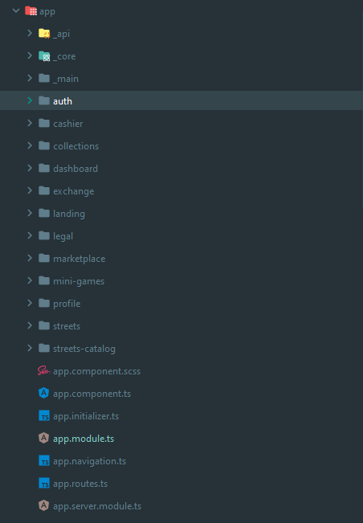
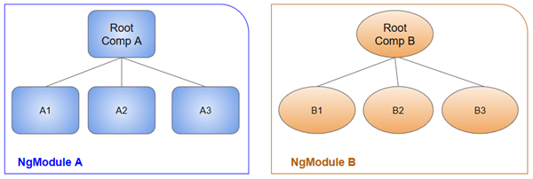
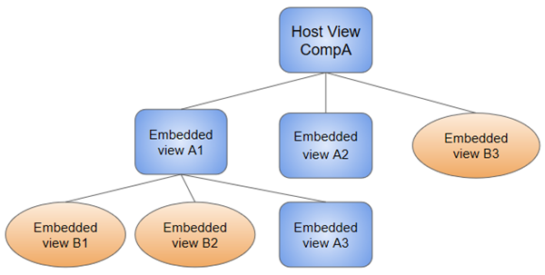
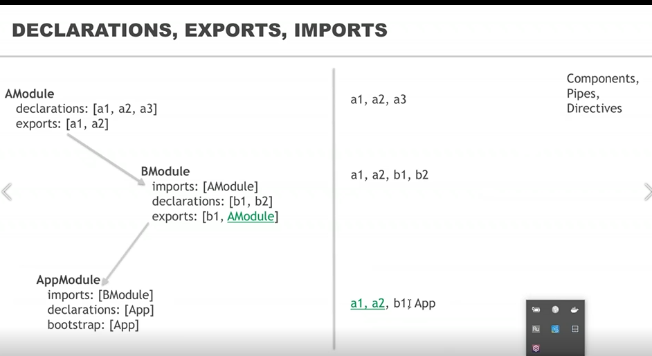
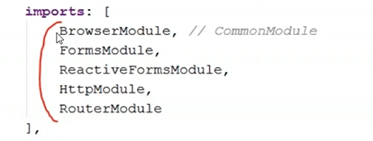

# Intro

ES6 Modules
```js
// lib.js
const com1, com2;
export { com1, com2 };

// app.js
import { com1, com2 } from './lib.js';
```

Angular Modules 

Angular Modules - 
 - Коллекция модулей
 - изменяют само приложение через метаданные 
 - Каждый модуль инкапсулирован 
 - имеют свои зависимости

## Подгрузка 

- Иницилизация модулей обычным способом 
- LazyLoading подгрузка 

## Best

- AppModule
- Domain - Организуется вокруг функции, бизнес-сферы или взаимодействия с пользователем.
- Routed	- Является верхним компонентом NgModule. Действует как пункт назначения маршрута навигации маршрутизатора .
- Routing	- Предоставляет конфигурацию маршрутизации для другого модуля NgModule.
- Service	- Предоставляет служебные services, такие как доступ к данным и обмен сообщениями.
- Widget	- Один component, directive, or pipe доступные в других модулях
- Shared	- Делает набор components, directives, and pipes доступные в других модулях

Example:


## NgModule 

| ХАРАКТЕРИСТИКИ | ПОДРОБНОСТИ                                                                                                           |
|-----------|-----------------------------------------------------------------------------------------------------------------------|
| declarations	 | Компоненты , директивы и пайпы , принадлежащие этому NgModule.                                                        |
| exports   | 	Подмножество объявлений, которые должны быть видны и использоваться в шаблонах компонентов других модулей NgModules. |
| imports	  |Другие модули, экспортированные классы которых необходимы шаблонам компонентов, объявленным в этом NgModule.|
| providers	|Создатели сервисов , которые этот NgModule вносит в глобальную коллекцию сервисов; они становятся доступными во всех частях приложения. (Вы также можете указать поставщиков на уровне компонентов.) |
| bootstrap |	Основное представление приложения, называемое корневым компонентом , в котором размещаются все остальные представления приложения. Только корневой NgModule должен устанавливать bootstrapсвойство. |

```typescript
import { NgModule } from '@angular/core';
import { BrowserModule } from '@angular/platform-browser';
@NgModule({
  imports:      [ BrowserModule ],
  providers:    [ Logger ],
  declarations: [ AppComponent ],
  exports:      [ AppComponent ],
  bootstrap:    [ AppComponent ]
})
export class AppModule { }
```






Все ангулярные пакеты - это отдельные модули!



