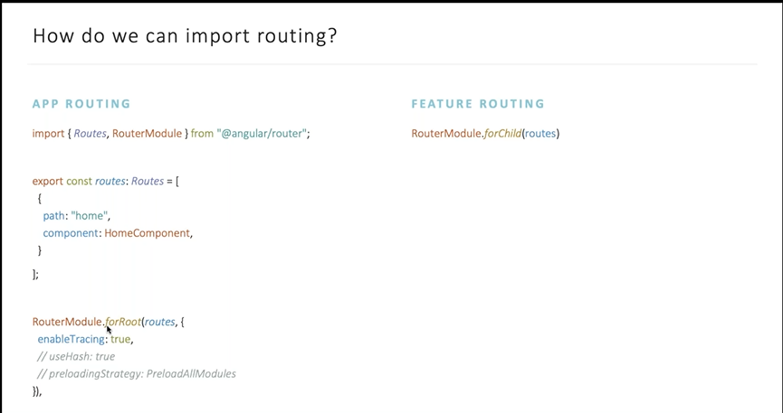
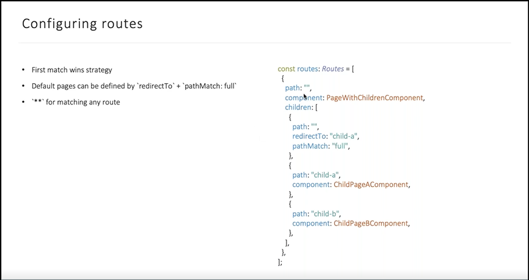
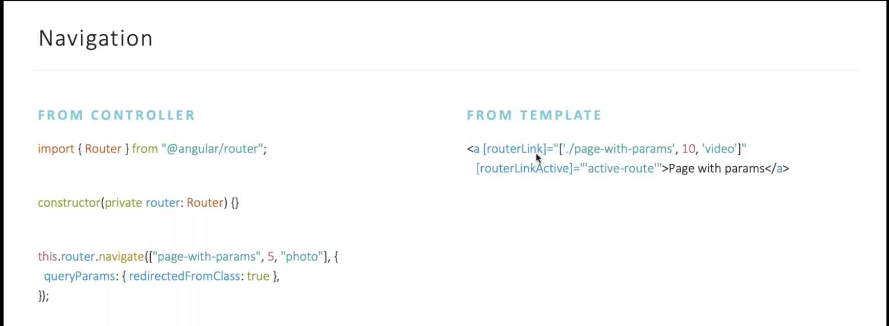
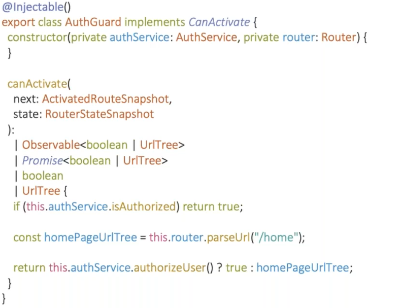
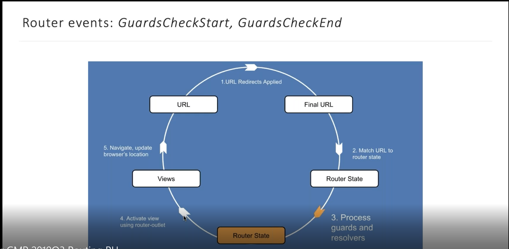

# Routing

Это встроенный модуль в Ангуляр. 
- По больше частит это сервисы и директивы. 
- Это обертка над history API (браузерной)
- Контроль над доступом в навигации (например система ролей, какому пользоватю можно, а какому нет)




- `enableTracing: true` - логирование роутинга
- `useHash: true` - переключает в режим использования хеш стратегиии // localhost:3002/src/#/crisis-center

## Configuration routes
 

## Navigation


### HTML
Всю навигацю нужно делать через router. В єтом преимущество SPA
- `[routerlink]` -  При применении к элементу в шаблоне делает этот элемент ссылкой, инициирующей навигацию по маршруту
```html
<a [routerLink]="['/user/bob']" queryParamsHandling="merge">
  link to user component
</a>
```
- `[routerLinkActive]='active-router'` - Если страница на которой находиться пользователь соответствует єтой урле, то добавляется вот єтот класс

### Component 

```typescript
this.router.navigate(['page-with-params', 5, 'photo'], {
    queryParams: { redirectionFromClass: true, anotherQuery: '2' }
});
this.router.navigateByUrl('');
```

# Guard



- CanActivate - можно ли пускать пользователя далее, если нет тогда перенаправить на другую страницу
- CanActivateChild - тоже самое но только для дочерних єлементов в роутинге
- CanDeactivate - нельзя покинуть страницу (не заполненная форма)
- CanLoad - можно ли подгружать компонент ?? (например для админки приложения)
- Resolve - перед тем как дать компоненту инцилизироваться дать компоненту предзагрузки каких-то данных (проблема белого экрана)

# LifeCycle router



# Examples 

https://github.com/dbr0vskyi/angular-routing-examples/tree/master/src/app
