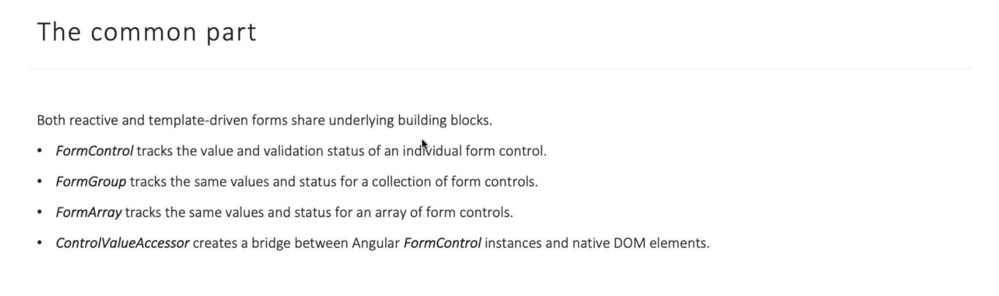
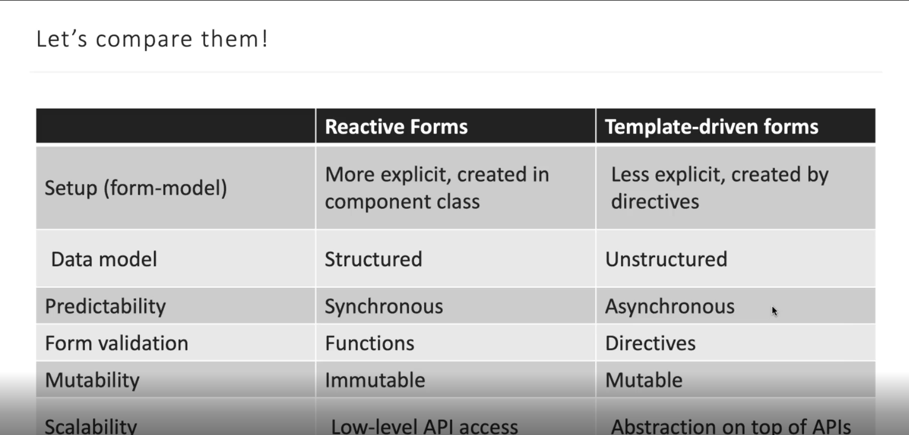

# Forms

- Template-Driven Form
- Reactive Forms 
    


## Template-Driven


## Reactive Forms




```typescript
import { Component } from '@angular/core';
import { FormGroup, FormControl } from '@angular/forms';

@Component({
  selector: 'app-profile-editor',
  templateUrl: './profile-editor.component.html',
  styleUrls: ['./profile-editor.component.css']
})
export class ProfileEditorComponent {
  profileForm = new FormGroup({
    firstName: new FormControl(''),
    lastName: new FormControl(''),
  });

  onSubmit() {
        console.warn(this.profileForm.value);
  }
}
```

```html
<form [formGroup]="profileForm" (ngSubmit)="onSubmit">

  <label for="first-name">First Name: </label>
  <input id="first-name" type="text" formControlName="firstName">

  <label for="last-name">Last Name: </label>
  <input id="last-name" type="text" formControlName="lastName">

    <p>Complete the form to enable button.</p>
    <button type="submit" [disabled]="!profileForm.valid">Submit</button>
</form>
```


## Validators 


```typescript
export class AppValidators {
    static spacePattern = /\s/gim;

    static email(control: AbstractControl): { [key: string]: boolean } | null {
        if (!control.value) {
            return null;
        }
        const isCorrectEmail = AppValidators.emailPattern.test(control.value);
        return !isCorrectEmail ? {email: true} : null;
    }
}

export class Component {
    email = new FormControl('', [Validators.required, AppValidators.email])
}
```

- AsyncValidators - TODO

### Updating parts of the data model

| METHODS | DETAILS                                                                                                           |
|-----------|-----------------------------------------------------------------------------------------------------------------------|
| setValue() | Установите новое значение для отдельного элемента управления. Метод setValue()строго придерживается структуры группы форм и заменяет все значение элемента управления. |
| patchValue()| Замените все свойства, определенные в объекте, которые были изменены в модели формы. |


```typescript
updateProfile() {
  this.profileForm.patchValue({
    firstName: 'Nancy',
    address: {
      street: '123 Drew Street'
    }
  });
}

updateEmail() {
    this.profileForm.controls.email.setValue('test@test.comn');
}
```

### FormBuilder

Сервис FormBuilderпредоставляет удобные методы для генерации элементов управления.


```typescript
import { Component } from '@angular/core';
import { FormBuilder } from '@angular/forms';

@Component({
  selector: 'app-profile-editor',
  templateUrl: './profile-editor.component.html',
  styleUrls: ['./profile-editor.component.css']
})
export class ProfileEditorComponent {
  profileForm = this.fb.group({
    firstName: [''],
    lastName: [''],
    address: this.fb.group({
      street: [''],
      city: [''],
      state: [''],
      zip: ['']
    }),
  });

  constructor(private fb: FormBuilder) { }
}
```
or

```typescript
profileForm = new FormGroup({
  firstName: new FormControl(''),
  lastName: new FormControl(''),
  address: new FormGroup({
    street: new FormControl(''),
    city: new FormControl(''),
    state: new FormControl(''),
    zip: new FormControl('')
  })
});
```

### FormArray 

FormArray - FormArray является альтернативой FormGroup управлению любым количеством безымянных элементов управления. Как и в случае с экземплярами группы форм, вы можете динамически вставлять и удалять элементы управления из экземпляров массива форм, а значение экземпляра массива формы и статус проверки рассчитываются на основе его дочерних элементов управления. Однако вам не нужно определять ключ для каждого элемента управления по имени, поэтому это отличный вариант, если вы заранее не знаете количество дочерних значений.
```typescript
import { FormArray } from '@angular/forms';

@Component({})
export class Component {
    profileForm = this.fb.group({
        firstName: ['', Validators.required],
        lastName: [''],
        aliases: this.fb.array([
            this.fb.control('')
        ])
    });

    get aliases() {
        return this.profileForm.get('aliases') as FormArray;
    }

    addAlias() {
        this.aliases.push(this.fb.control(''));
    }
}
```

```html
<div formArrayName="aliases">
  <h2>Aliases</h2>
  <button type="button" (click)="addAlias()">+ Add another alias</button>

  <div *ngFor="let alias of aliases.controls; let i=index">
    <!-- The repeated alias template -->
    <label for="alias-{{ i }}">Alias:</label>
    <input id="alias-{{ i }}" type="text" [formControlName]="i">
  </div>
</div>
```


### Summary 

Классы

| Class | Details                                                                                                                                                                                       |
| --- |-----------------------------------------------------------------------------------------------------------------------------------------------------------------------------------------------|
| AbstractControl | Абстрактный базовый класс для конкретных классов управления формой FormControl, FormGroupи FormArray. Он обеспечивает их общее поведение и свойства.                                          |
  | FormControl | Управляет значением и статусом достоверности отдельного элемента управления формой. Он соответствует элементу управления HTML-формы, например \<input> или \<select>.                         |
| FormGroup | Управляет значением и состоянием достоверности группы AbstractControlэкземпляров. Свойства группы включают дочерние элементы управления. Форма верхнего уровня вашего компонента — FormGroup. | 
 | FormArray | Управляет значением и состоянием допустимости числового индексированного массива экземпляров AbstractControl.                                                                                 |
 | FormBuilder | Внедряемый сервис, предоставляющий фабричные методы для создания экземпляров элементов управления.                                                                                            | 
 | FormRecord | Отслеживает значение и состояние достоверности коллекции экземпляров FormControl, каждый из которых имеет один и тот же тип значения.                                                         |
	
Директивы 	

| DIRECTIVE | DETAILS                                                                                             |
| ---- |-----------------------------------------------------------------------------------------------------|
| FormControlDirective | Синхронизирует автономный FormControl экземпляр с элементом управления формой.                      |
| FormControlName | Синхронизирует FormControl существующий FormGroup экземпляр с элементом управления формой по имени. |
| FormGroupDirective | 	Синхронизирует существующий FormGroup экземпляр с элементом DOM.                                   |
| FormGroupName | Синхронизирует вложенный FormGroup экземпляр с элементом DOM.                                       |
| FormArrayName |       Синхронизирует вложенный FormArrayэкземпляр с элементом DOM.                                                                                              | 

## Difference 



### Questions 

- Какие бывают типы валидаторов?
- что такое async валидатор | AsyncValidator
- statusChanges control - subscriber - какие статусы может выдать?
- в чем отличается setValue & pathValue 
- Какие св-ва принимает FromControl при инициализации
- ValueChanges вернет все поля включая задизейбленные или нет?
- FormGroupDirective и FormControlDirective что это?
- СontrolValueAccessor что это?
- getRawValue & value в чем разница ? (this.form.value || this.form.getRawValue)
- Как задизейблить FormControl
- как задать значение так чтобы не сработал valueChanges?
- "Forms: Стандартные (Template-driven); Реактивные (Reactive)." в чем разница?
- Что должен вернуть валидатор?
- Как называет тип реактивных форм когда можно добавлять на лету
- Какие обьекты есть для создания Reactive Form
- Какие статусы бывают у реактивных форм?

## TODO 
- Типизация форм
- 
