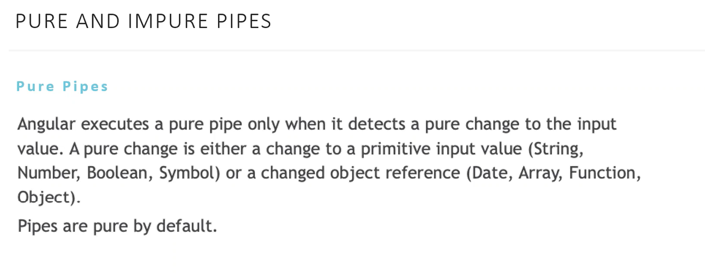

# Pipe

Pipe — это простые функции, которые можно использовать в выражениях шаблонов для приема входного значения и возврата преобразованного значения. Pipe полезны, поскольку вы можете использовать их во всем приложении, объявляя каждый канал только один раз


- DatePipe: Formats a date value according to locale rules.
- UpperCasePipe: Transforms text to all upper case.
- LowerCasePipe: Transforms text to all lower case.
- CurrencyPipe: Transforms a number to a currency string, formatted according to locale rules.
- DecimalPipe: Transforms a number into a string with a decimal point, formatted according to locale rules.
- PercentPipe: Transforms a number to a percentage string, formatted according to locale rules.
- AsyncPipe 
- JsonPipe 
- SlicePipe


## Custom Pipe


```typescript
@Pipe({
  name: 'nickname',
})
export class NicknamePipe implements PipeTransform {
  constructor(private userService: UserService) {}

  transform(username: string | undefined, ownName = 'You', userUid?: string): string | undefined {
    if (
      (username === this.userService.user.username && this.userService.user.username && ownName) ||
      (userUid && this.userService.user.id === userUid)
    ) {
      return ownName;
    }
    if (username === 'Admin') {
      return 'World';
    }
    if (username) {
      return username.includes('User_') ? 'Anonymous' : username;
    }
    return 'World';
  }
}

```

## PurePipe

Только тогда когда изменилась ссылка на обьект



## ImPure Pipe
При любом изменении на компоненте


## General


# Directive

## Components
## Attributes Directives


| COMMON DIRECTIVES | DETAILS                                 |
| ---- |-----------------------------------------|
| NgClass | Добавляет и удаляет набор классов CSS.  |
| NgStyle |           Добавляет и удаляет набор стилей HTML.                              | 
| NgModel |       Добавляет двустороннюю привязку данных к элементу формы HTML.                                  |

### NgClass

```html
<div [ngClass]="isSpecial ? 'special' : ''">This div is special</div>
```

```typescript
class Component {
    // CSS classes: added/removed per current state of component properties
    currentClasses =  {
        saveable: this.canSave,
        modified: !this.isUnchanged,
        special:  this.isSpecial
    };
}
```
```html
<div [ngClass]="currentClasses">This div is initially saveable, unchanged, and special.</div>
<some-element [ngClass]="'first second'">...</some-element>

<some-element [ngClass]="['first', 'second']">...</some-element>

<some-element [ngClass]="{'first': true, 'second': true, 'third': false}">...</some-element>

<some-element [ngClass]="stringExp|arrayExp|objExp">...</some-element>

<some-element [ngClass]="{'class1 class2 class3' : true}">...</some-element>
```

###  NgStyle 

```typescript
class Component {
    // CSS classes: added/removed per current state of component properties
    currentStyles = {
        'font-style':  this.canSave      ? 'italic' : 'normal',
        'font-weight': !this.isUnchanged ? 'bold'   : 'normal',
        'font-size':   this.isSpecial    ? '24px'   : '12px'
    };
}
```
```html
<some-element [ngStyle]="{'font-style': styleExp}">...</some-element>
<div [ngStyle]="currentStyles">
    This div is initially italic, normal weight, and extra large (24px).
</div>
```

## Structural directives


| DIRECTIVES | DETAILS |
| ---- | --- |
| NgIf | Условно создает или удаляет подпредставления из шаблона. |
| NgFor| Повторите узел для каждого элемента списка.|
| NgSwitch	| Набор директив, которые переключают альтернативные представления. |


## Custom Directive
