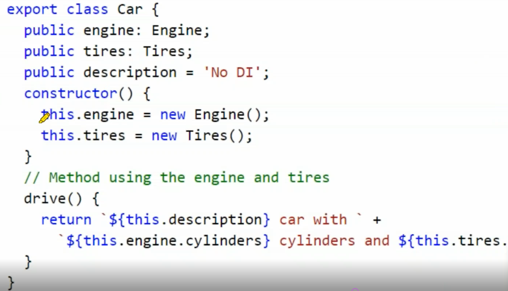
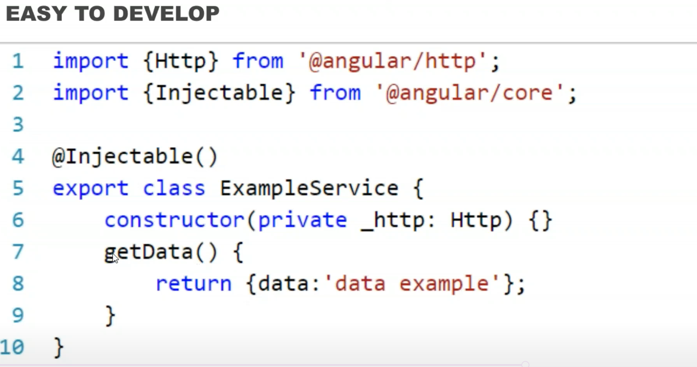
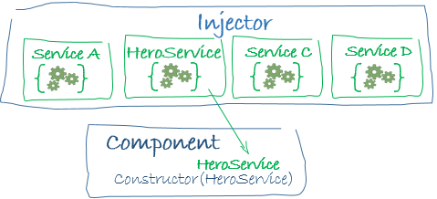

# Dependency Injection




```typescript
@Injectable()
```

```typescript
constructor(private service: HeroService) { }
```






```typescript
@Injectable({
 providedIn: 'root',
})
@NgModule({
    providers: [
        BackendService,
        Logger
    ],
…
})
@Component({
    selector:    'app-hero-list',
    templateUrl: './hero-list.component.html',
    providers:  [ HeroService ]
})
```

SELF EDUCATION:
https://angular.io/guide/dependency-injection-in-action

