# RxJS

https://rxjs.dev/

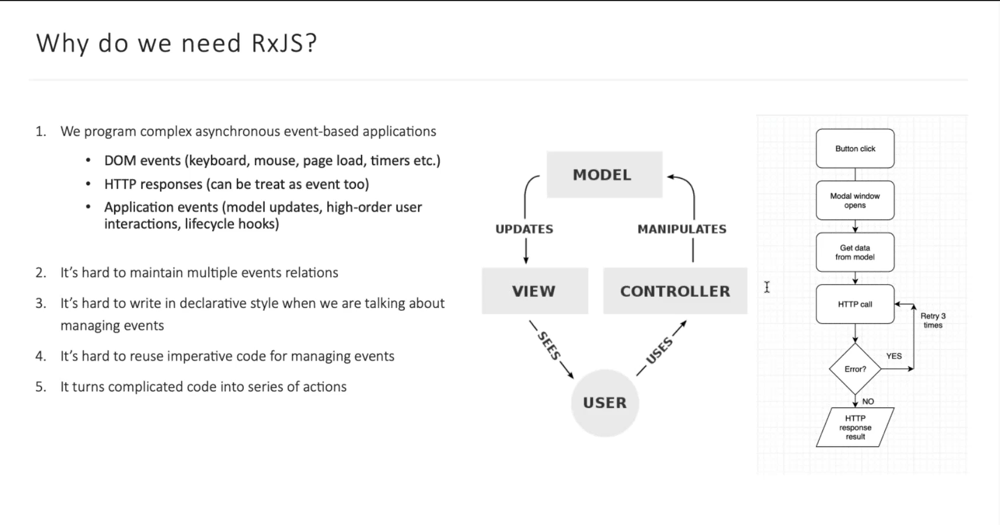

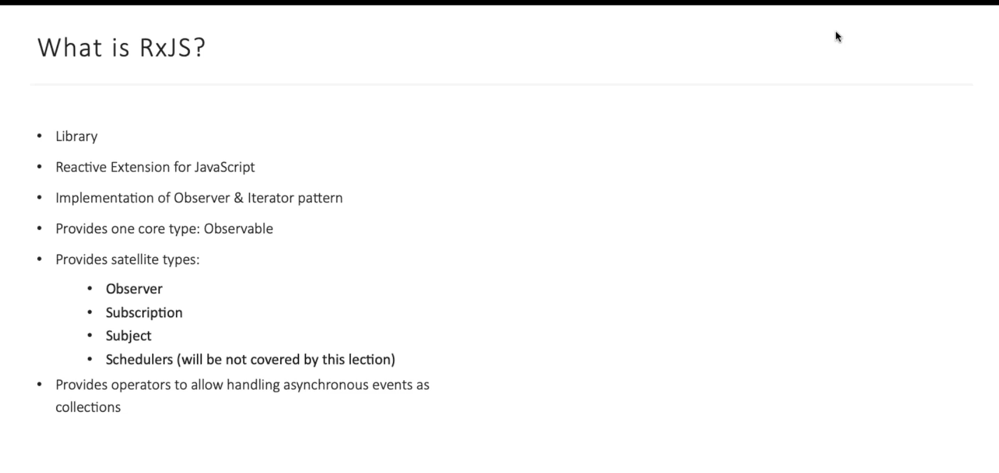

В коре лежит "Obserable & Iterator"

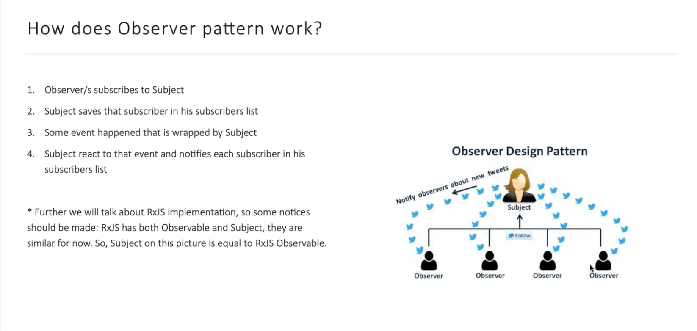

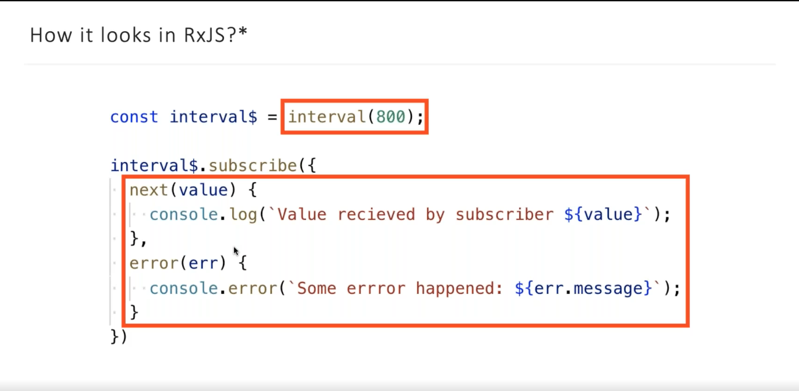

https://rxviz.com/examples/basic-interval

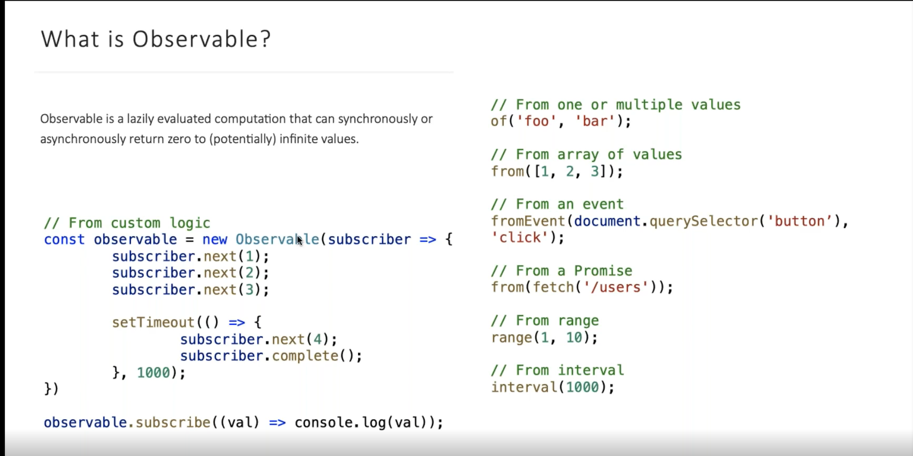

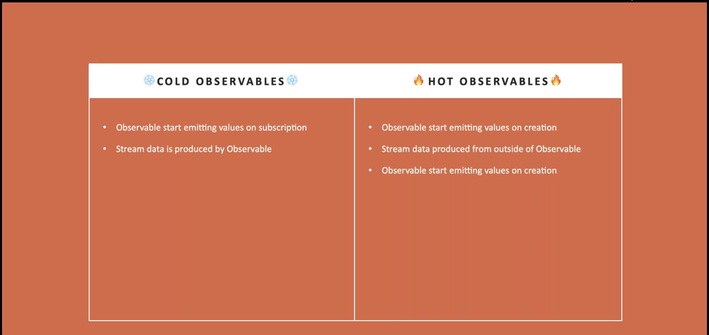

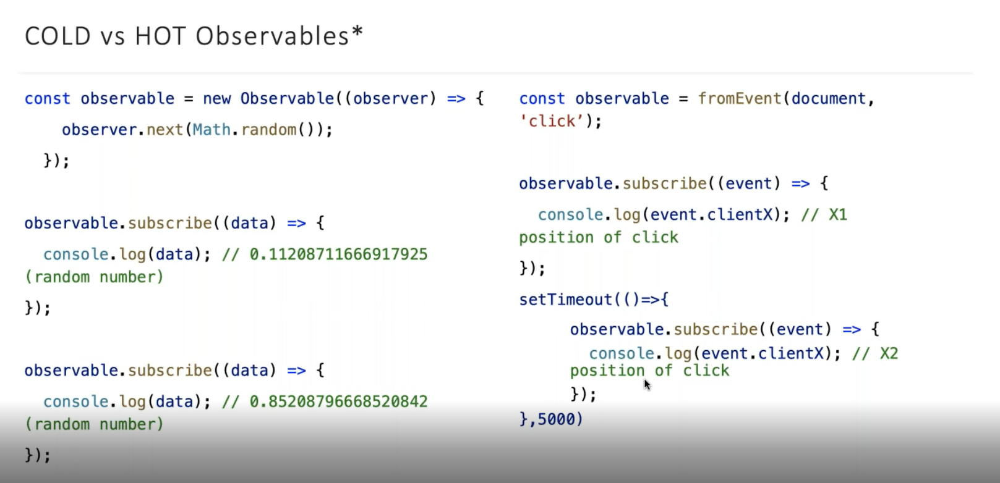

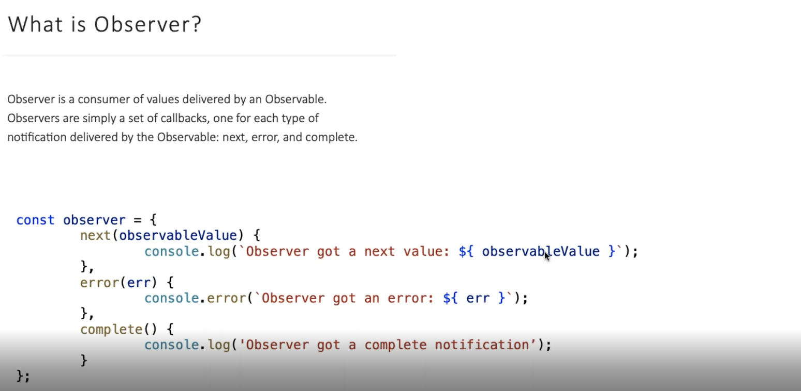

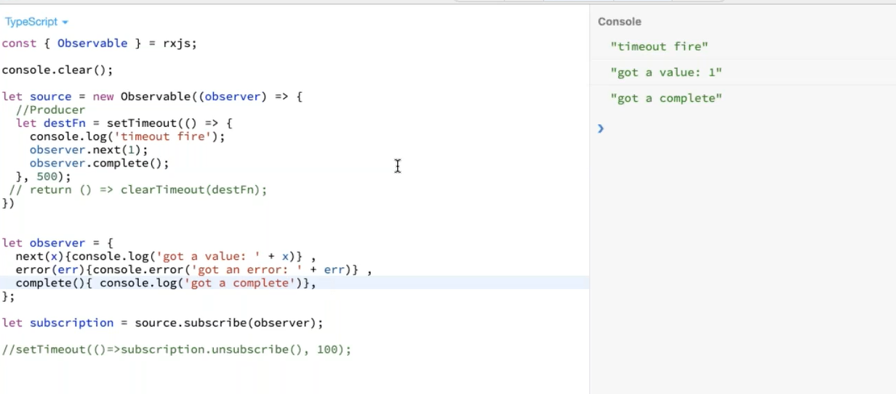

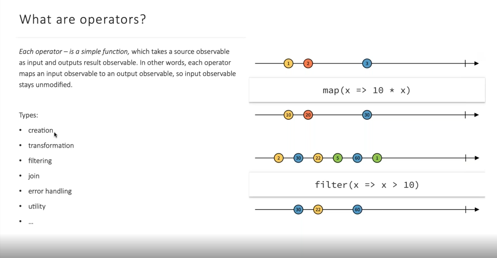

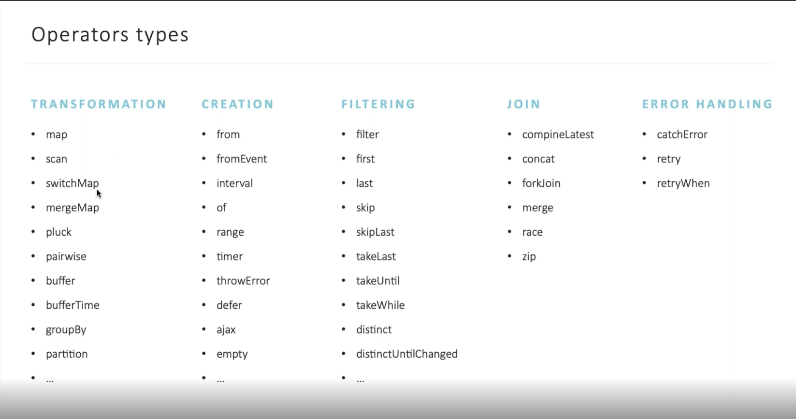

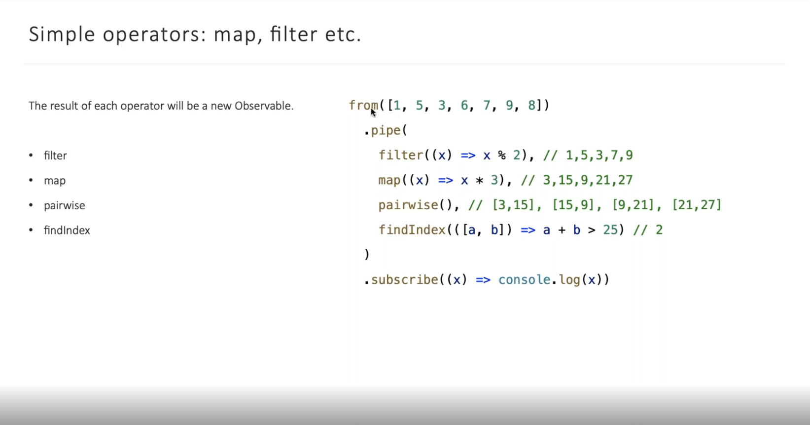

# Complex operator -> Те операторы которые агрегриют разные стримы сразу
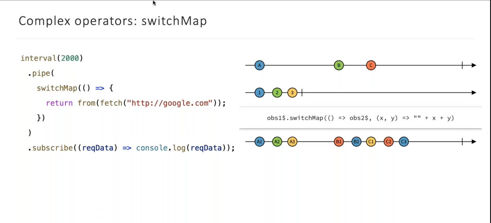

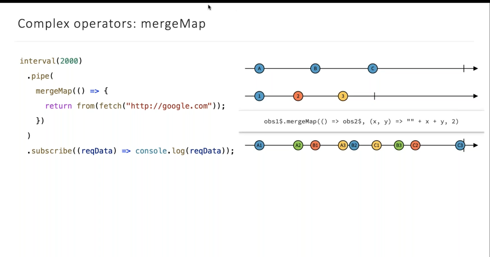

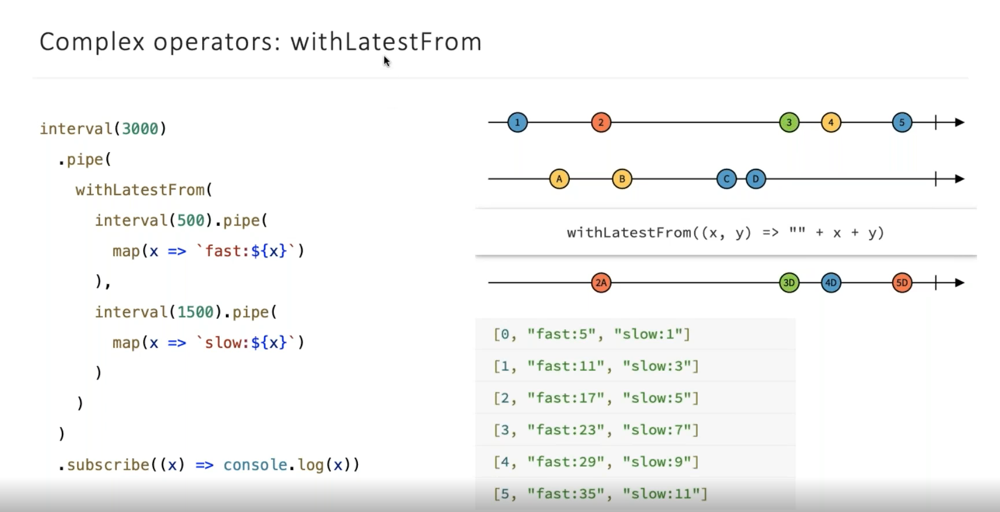

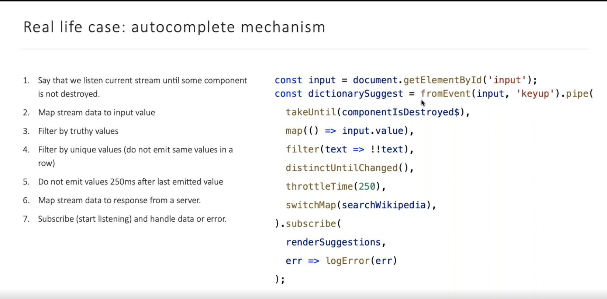

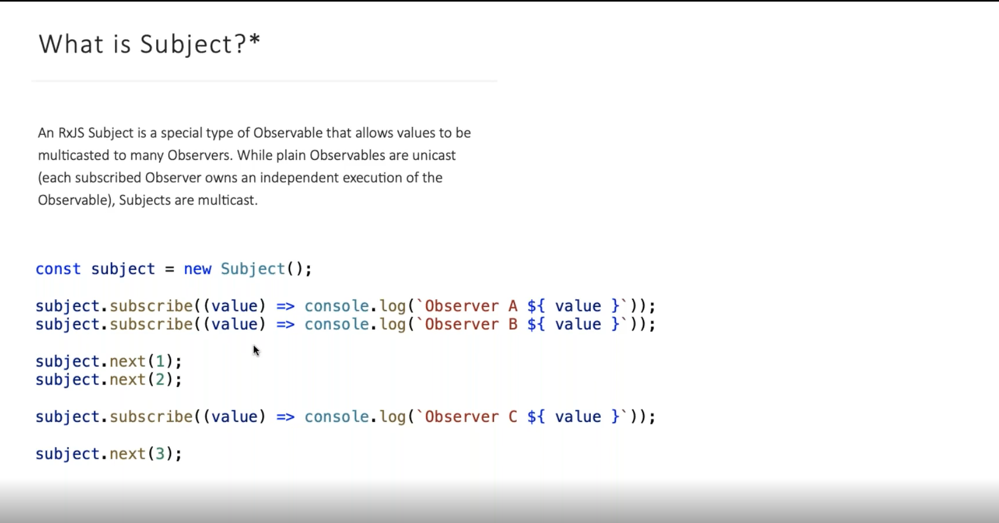

- Subject
- BehaviorSubject
- AsyncSubject

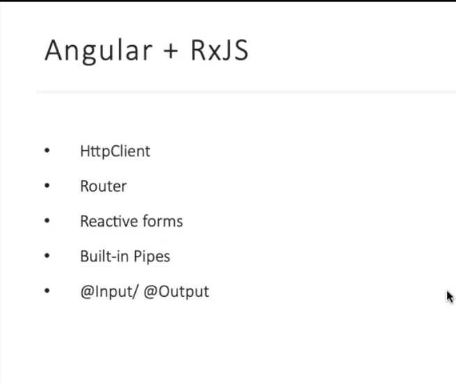

QUESTIONS:
- hot and cold Obserable
- concatMap, mergeMap, switchMap,  exhaustMap.: внешний и внутренний поток
- разновидности Subject
- в чем разница promise & obserable & subject, что ленивое что не линивое
- Как можно отписаться от подписок
- RxJS - какие методы и операторы ты знаешь
- withlatestfrom RxJS
- IIF шото такое
- Как превратить Obserable to Subject
- pipe RxJS - какие знаешь
- asyncScheduler
- distinctUntilChanged

